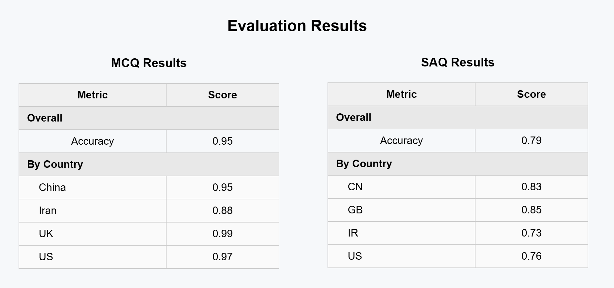

# Behind the Secrets of Large Language Models — Cultural Question Answering

## 📌 Project Overview

This project focuses on developing a **Large Language Model (LLM)–based system** for answering culturally grounded questions. The benchmark evaluates how well models understand cultural and linguistic contexts across multiple regions.

The system handles two tasks:

* **Multiple Choice Questions (MCQ)** — Select the correct answer (A–D)
* **Short Answer Questions (SAQ)** — Generate the answer directly

---

## 🎯 Project Goal

Build an effective cultural question answering pipeline using LLM techniques such as:

* Model finetuning
* Prompt tuning
* Retrieval-Augmented Generation (RAG)
* Self‑Consistency
* Agentic frameworks
* Self‑RAG

⚠️ **Model Constraint:**

To ensure fairness, only the following base model is allowed:

> **Meta Llama 3 — 8B**

Using other pre‑existing LLMs is not permitted.

---

## 📂 Dataset Description

The dataset contains English-language cultural questions from **four different cultural contexts**.

Provided files:

| Task | Train Dataset           | Test Dataset           |
| ---- | ----------------------- | ---------------------- |
| MCQ  | `train_dataset_mcq.csv` | `test_dataset_mcq.csv` |
| SAQ  | `train_dataset_saq.csv` | `test_dataset_saq.csv` |

You may split the training data into train/validation sets as needed.

---

## 🧠 Task Details

### 1️⃣ Multiple Choice Questions (MCQ)

Given a question and four options (A–D), the model must select the correct answer.

**Example**

> What is the most popular traditional musical instrument in the UK?
>
> A. angklung
> B. derbouka
> C. erhu
> D. guitar

**Correct Answer:** D

**Evaluation Metric:** Accuracy

---

### 2️⃣ Short Answer Questions (SAQ)

The model generates answers directly instead of choosing options.

**Example**

> On which holiday do all family members tend to reunite in the US?

**Acceptable Answers:**

* thanksgiving
* christmas

**Evaluation Metric:**

Accuracy based on human‑annotated references.

⚠️ Synonyms/paraphrases are **not** considered unless listed.

---

## ⚙️ Methodology

This repository implements:

* Instruction prompting
* Few‑shot learning
* Logits‑based option scoring (MCQ)
* Constrained decoding for short answers
* Quantized inference for HPC efficiency

---

## 🚀 Running the Project

### 1️⃣ Install Dependencies

```bash
pip install torch transformers pandas tqdm bitsandbytes
```

---

### 2️⃣ Model Setup

The script automatically downloads the model from Hugging Face on first run.

Default configuration uses:

* 4‑bit quantization
* NF4 quant type
* FP16 compute
* Auto device mapping

---

### 3️⃣ Run Inference

```bash
python main.py
```

Outputs:

* `mcq_prediction.tsv`
* `saq_prediction.tsv`

---

## 📝 Submission Format

### MCQ File — `mcq_prediction.tsv`

```tsv
MCQID	A	B	C	D
Kik-in-31_149	False	False	False	True
New-am-54_914	False	True	False	False
```

---

### SAQ File — `saq_prediction.tsv`

```tsv
ID	answer
Kik-in-31_149	Guitar
New-am-54_914	Chips
```

---

## 📦 Final Submission

1. Zip the prediction files:

```bash
zip submission.zip mcq_prediction.tsv saq_prediction.tsv
```

2. Upload to Codabench competition.

Submission stages:

* Preparing
* Submitted
* Scoring
* Finished
* Failed

---

## 📊 Evaluation Results



---

## 🏆 Leaderboard

After scoring:

* Publish results via **Actions → Publish**
* Ranking based on **average score (MCQ + SAQ)**

---

## ⚖️ Fair Use Policy

* Do not train on test data
* Do not spam submissions
* Do not exploit evaluation loopholes

The benchmark is designed for **fair academic comparison**.

---

## 📬 Contact

If evaluation issues occur, contact the benchmark organizer.

---

## 📄 License

This project is for academic and research purposes only.

---

⭐ Feel free to fork, experiment, and improve cultural QA systems!
